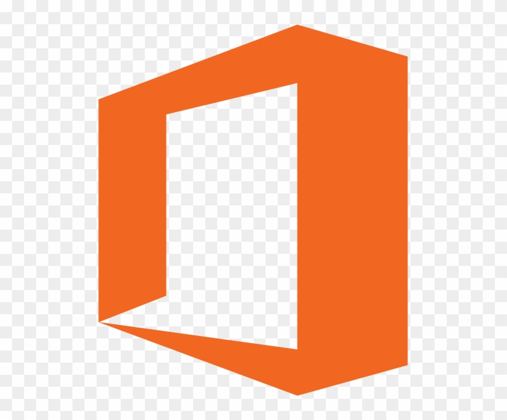

## Live long and prosper 🖖

<li>Bacharelado em Engenharia da Computação (5° Período) - UP - Conclusão prevista: Dez/ 2027 </li>

---

## 💻 Conhecimentos

<li><i>Pacote office</i></li>
<li>Visual Studio Code<i></i></li>
<li><i></i>Notion</li>
<li><i>Linguagem Python</i></li>
<li><i>Linguagem C</i></li>
<li><i>Linguagem Java</i></li>
