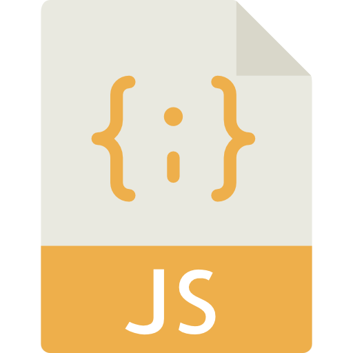
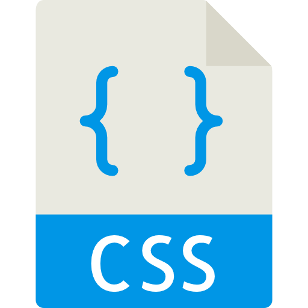

## Live long and prosper 🖖

<li>Bacharelado em Engenharia da Computação (6° Período) - UP - Conclusão prevista: Dez/ 2027 </li>

---

## 💻 Conhecimentos

<li><i> Visual Studio Code</i></li>
<li><i> IntelliJ</i></li>
<li><i> Notion</i></li>
<li><i> Linguagem Python</i></li>
<li><i> Linguagem C</i></li>
<li><i> Linguagem Java</i></li>
<li><i> Spring Framework</i></li>
<li><i> PostgreSQL</i></li>
<li><i> Docker</i></li>
<li><i> Postman</i></li>
<li><i> Linguagem JavaScript</i></li>
<li><i> HTML</i></li>
<li><i> CSS</i></li>
